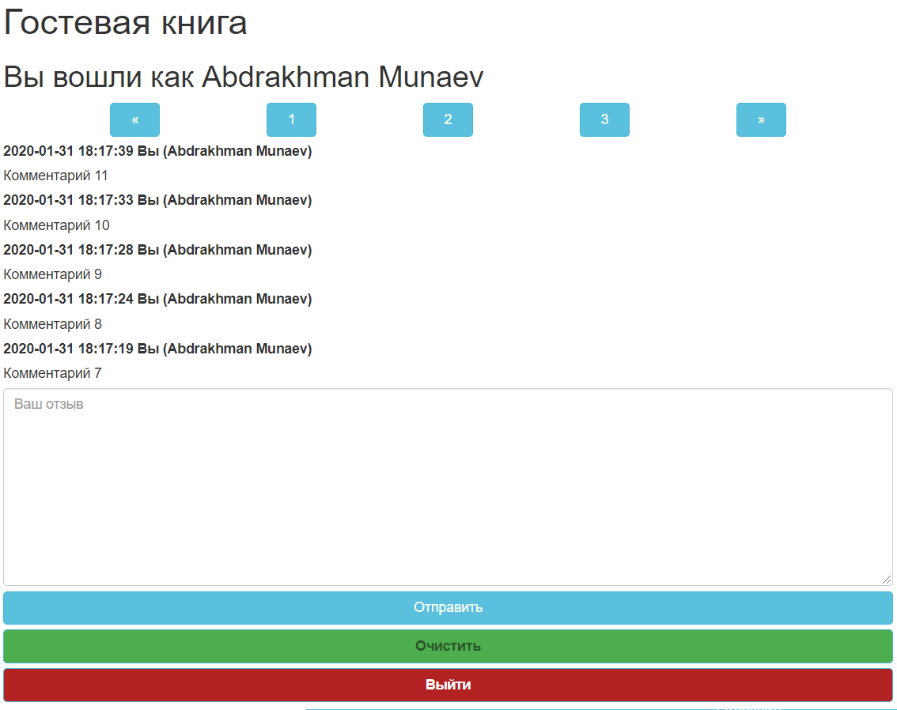
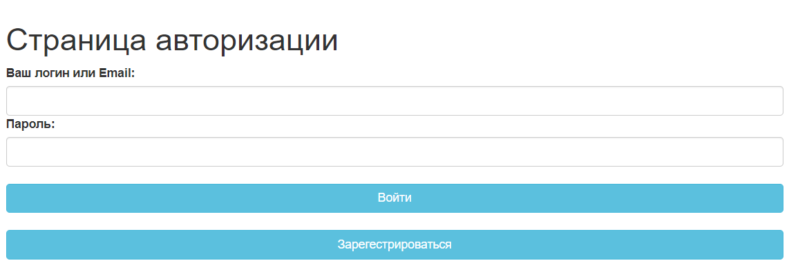
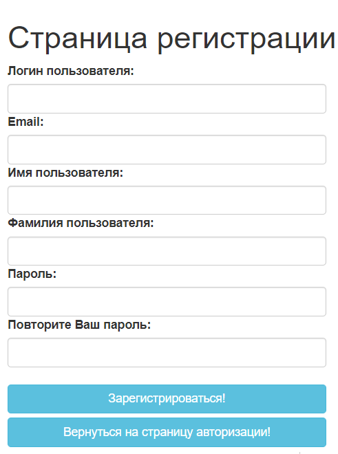

## Проект Гостевая книга ## 
###### Автор: Абдрахман Мунаев
## Содержение ##
1) [Страницы книги](#Страницы-книги)
    * [Главная страница(index.php);](#Главная-страница) 
    * [Страница авторизации(login.php);](#Страница-авторизации)
    * [Страница регистрации(regist.php);](#Страница-регистрации)
2) [Описание проекта](#Описание-проекта)
3) [ООП(классы и методы)](#ООП)
    * [Класс DB;](#Класс-DB) 
    * [Класс User;](#Класс-User)
    * [Класс Valid;](#Класс-Valid)
    * [Класс Comment;](#Класс-Comment)
4) [Функционал книги](#Функционал-книги)
    * [Пагинация;](#Пагинация) 
    * [Проверка на уникальность;](#Проверка-на-уникальность)
    * [Шифрование пароля;](#Шифрование-пароля)
    * [Сохранение значений в формах при перезагрузке страницы;](#Сохранение-значений-в-формах-при-перезагрузке-страницы)
5) [Резюме](#Резюме)

## Страницы книги
#### Главная страница

#### Страница авторизации

#### Страница регистрации

## Описание проекта
Данный проект представляет собой гостевую книгу,
где пользователь заходит на сайт регистрируется,
дальше авторизируется.
На главной страницу посетитель, после успешного входа,
может оставлять свои сообщения, которые видны всем
пользователям данной книги.

## ООП 
Гостевая книга написана с использованием методологии ООП.
В нем реализуются такие классы как:  
      
      DB.php
      User.php
      Valid.php
      Comment.php

#### Класс DB
Данный класс используется для подключения к базе данных.
У него есть приватные свойства, которые используются в методе конструктора при создании объекта, т.е. происходит 
подключение к базе данных. По умолчанию значения равны константам, 
которые прописаны в файле config.php.  
    
    protected $conn = null;
    private $_host = HOST;
    private $_dbname = DBNAME;
    private $_user = USER;
    private $_password = PASSWORD;
    private $_error;
Так же данный класс имеет метод:  
    
    public function getError(),  

который получает ошибку при неудачном подключении к базе данных.  

И метод:  

    public function getMaxLen($table, $column),  

который принимает 2 аргумента(название таблицы, название столбца) подключившись к базе данных, возвращает максимальную длину поля.  

#### Класс User  
Класс User нам необходим для того, чтобы проводить различные манипуляции с нашим пользователем.  
Класс имеет свойства:  

    public $id;
    public $userName;
    public $password;
    public $email;
    public $firstName;
    public $lastName;        
Так же у класса имеются методы:  

    public function save()
Для сохранение  данных нашего пользователя при регистрации.

    public function find($id)
Метод find() нам необходим на главной странице, для подписи комментариев.

    public function checkLogin($userName, $password)
Метод checkLogin($userName, $password) работает при авторизации и принимает 2 аргумента(Логин или Email, пароль).  

Метод:  

    public function getUserName($userName)
    public function getEmail($email)
используются в для проверки логина и Email на уникальность.  

#### Класс Valid  
Данный класс проверяет наши инпуты при регистрации пользователя.  
Класс имеет свойство $errors = []; - массив, который принимает все ошибки. На странице регистрации данный 
массив перебирается циклом foreach()

    public function checkEmpty($name, $value)
Метод принимает название поля и его значение и проверяет формы на непустоту. 

    public function checkMatch($name1, $value1, $name2, $value2)
Проверяет соответствие пароля и подтверждения пароля.

    public function checkMaxLen($name, $value, $table, $column)
Данный метод подключаясь к БД через метод DB::getMaxLen($table, $column) проверяет максимальную длинну заполненных полей.

    public function checkMinLen($name, $value, $minLen)
Проверяет минимальную длинну полей.

    public function isUsernameAvailable($userName)
Проверяет Логин пользователя на уникальность при регистрации.

    public function isEmailAvailable($email)
Проверяет Email пользователя на уникальность при регистрации.  

#### Класс Comment
Данный класс работает на главной странице книги. Он отвечает за сохранение, вывод и удаление комментариев.

    public $id;
    public $userId;
    public $text;
    public $created_at;
    public $notesOnPage = 5;
В свойстве $notesOnPage прописывается количество комментариев выводимых на одной странице.
    
    public function save()
Функция save() сохраняет наш комментарий.

    public function findAll()
Возврщает массив всех комментариев из БД.

    public function lenPage()
Данный метод считает количство страниц для пагинации.

    public function pagin($page)
А этот метод выводит комментарии в зависимости на какой странице мы находимся.

    public function clean()
clean() удаляет все наши комментарии с БД.

    private function lenCom()
Считает количество комментариев в БД.

## Функционал книги
В моей книге реализован некоторый функционал для удобства пользования.

#### Пагинация
Первыми на сайте выводятся самые новые комментарии. 
При написани большого количества комментариев, происходит их разбиение на страницы, при помощи формулы:

     $from = ($page-1)*$this->notesOnPage;
Т. е. в зависимости от страницы в переменную $form кладется значение с какого комментария необходимо выводить с БД.
Вывод комментариев с БД производится с помощью запроса:

    SELECT * FROM comments ORDER BY id DESC LIMIT  $from,$this->notesOnPage

#### Проверка на уникальность
Так же в книге реализована проверка на уникальность Логина и Email на стороне front-end  при помощи JavaScript.
При вводе пользователем Логина и Email и переключения на другое поле, JS отправляет введеные данные в checker.php, а php делает запрос в БД,
и если такие значения найдены, возвращает ошибку, после чего JS обрабатывает и блокирует кнопку зарегистрироваться и выводит ошибку.
#### Шифрование пароля
Шифрование пароля происходит про помощи функции sha1 и смещения его с контстантой SALT - это затруднит злоумышлиннику расшифровку наших паролей, 
он получит доступ к БД.
#### Сохранение значений в формах при перезагрузке страницы

При регистрации и авторизации на сайте, если после нажатия кнопки "submit" выводятся ошибки, то данные введенные в поля сохраняются в них при
помощи констркукции:

    echo (!empty($_POST['ИМЯ ПОЛЯ']) ? $_POST['ИМЯ ПОЛЯ']: '');
    
# Резюме 

    
 

